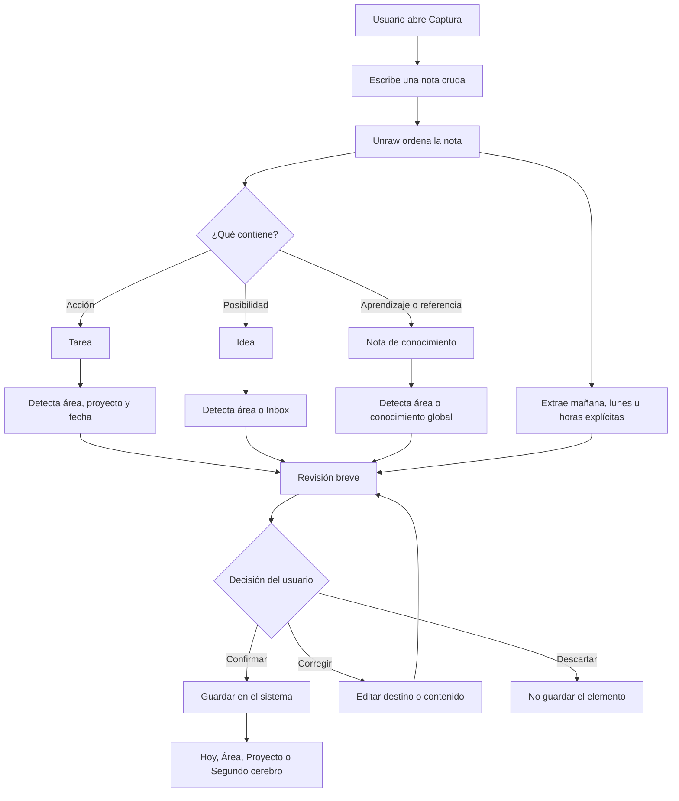

# Unraw

> Captura lo que tienes en la cabeza. Unraw le da forma.

Unraw es una aplicación de productividad personal **capture-first**. Permite escribir pensamientos crudos —sin formato, contexto o estructura— y convertirlos en tareas, ideas y conocimiento organizado dentro del propio sistema del usuario.

La promesa es simple: **el usuario piensa; Unraw organiza**.

## Por qué existe

La mayoría de las herramientas de productividad empiezan pidiendo que la persona diseñe un sistema: áreas, proyectos, etiquetas, bases de datos y reglas. Eso crea fricción justo en el momento en que alguien necesita capturar algo rápido.

Unraw invierte la relación:

1. La persona captura como habla y piensa.
2. Unraw interpreta el contenido, el contexto, las fechas y los destinos posibles.
3. La persona confirma, corrige o deja algo en Inbox.
4. El sistema aprende de esas correcciones y se adapta progresivamente.

## Inicio rápido

### Requisitos

- Node.js 20, 22 o 24+
- Yarn 1.x
- Un proyecto de Supabase
- Una clave de OpenAI o una cuenta configurada con OpenRouter

### Instalación

```bash
git clone https://github.com/SebastianV75/unraw.git
cd unraw
yarn install
cp web/.env.example web/.env.local
```

Rellena `web/.env.local` y aplica las migraciones de `supabase/migrations/` en tu proyecto de Supabase.

### Desarrollo

```bash
yarn dev
```

Abre [http://localhost:3000](http://localhost:3000).

- `/` — landing pública
- `/login` — acceso
- `/capture` — captura principal
- `/overview` — Hoy
- `/inbox` — triage
- `/areas` — contexto y proyectos
- `/second-brain` — conocimiento global

## Flujo principal



## Capacidades actuales

### Captura inteligente

- Editor de escritura rápida con foco automático.
- Procesamiento de notas largas o mezcladas.
- Clasificación en tareas, ideas y conocimiento.
- Inferencia de área y proyecto existente.
- Detección de fechas naturales como `mañana`, `el lunes` o `viernes a las 15:00`.
- Fechas guardadas con respeto por la zona horaria del navegador.
- Revisión editable, reversible y sin controles obligatorios.
- Elementos sin destino guardados en Inbox.
- Protección de guardado mediante idempotencia.

### Inbox como triage

- Separación entre elementos sin hogar e historial.
- Filtros por tipo de contenido.
- Los selectores de área y proyecto aparecen solo cuando la persona decide organizar.
- Acciones de asignación explícitas y seguras.

### Hoy

- Siguiente acción destacada.
- Cola breve de tareas posteriores.
- Inbox pendiente como contexto, no como alarma.
- Proyectos activos en segundo plano.

### Segundo cerebro

- Notas globales y notas asociadas a un Área.
- Editor Markdown con vista previa en vivo.
- Toolbar discreta para formato frecuente.
- Renderizado Markdown al leer.
- Etiquetas opcionales.
- Escritura contextual desde cada Área.

### Navegación y accesibilidad

- Captura como entrada principal.
- Command Palette con `Ctrl+K` / `Cmd+K`.
- Tema claro y oscuro.
- Estados de foco y teclado.
- `prefers-reduced-motion` respetado.
- Diseño responsive para escritorio y móvil.

## Estructura del repositorio

```text
unraw/
├── web/                         # Aplicación Next.js
│   ├── app/                     # Rutas, layouts y API routes
│   ├── components/              # Componentes de interfaz
│   ├── lib/                     # Supabase, IA y lógica de dominio
│   ├── types/                   # Tipos compartidos
│   └── .env.example             # Variables necesarias
├── supabase/                    # Schema y migraciones SQL
├── design-system/               # Decisiones visuales y referencias
├── docs/                        # Documentación de producto
├── docs-content/                # Contenido editorial del proyecto
├── skills/                      # Guías operativas para agentes
└── unraw-prd.md                 # PRD histórico y contexto de producto
```

## Stack

| Capa | Tecnología | Uso |
| --- | --- | --- |
| Aplicación | Next.js 15, React 19, TypeScript | UI, rutas y server/client components |
| Estilos | Tailwind CSS 4, DaisyUI, CSS tokens | Layout, estados y temas |
| Animación | Motion | Crossfades y transiciones discretas |
| Iconos | Reicons | Iconografía consistente |
| Persistencia | Supabase PostgreSQL | Datos, migraciones y RPC transaccional |
| Auth | Supabase Auth | Registro, login, OAuth y sesiones |
| IA | OpenAI / OpenRouter | Clasificación, contexto, fechas y sugerencias |
| Email | Resend | Waitlist y correo transaccional |
| Despliegue | Dokploy, Vercel-compatible | Aplicación Next.js server-rendered |

## Variables de entorno

Consulta [`web/.env.example`](web/.env.example).

Variables principales:

```env
NEXT_PUBLIC_APP_URL=http://localhost:3000
NEXT_PUBLIC_SUPABASE_URL=
NEXT_PUBLIC_SUPABASE_ANON_KEY=
SUPABASE_SERVICE_ROLE_KEY=
OPENAI_API_KEY=
RESEND_API_KEY=
OPENROUTER_TOKEN_ENCRYPTION_KEY=
```

Las variables de PostHog y Google OAuth son opcionales.

## Comandos

```bash
# Desarrollo
yarn dev

# Build de producción
yarn workspace web build

# Lint
yarn workspace web lint

# Arrancar la build
yarn workspace web start
```

## Despliegue

Unraw es una aplicación Next.js dinámica, no un sitio estático.

Configuración recomendada en Dokploy:

- **Build path:** `/`
- **Build type:** Railpack
- **Build command:** `yarn workspace web build`
- **Start command:** `yarn workspace web start`
- **Puerto:** `3000`
- **Watch paths:** `web/**`, `supabase/**`

Configura las variables de entorno en el servidor y actualiza en Supabase:

- Site URL: `https://tu-dominio.com`
- Redirect URL: `https://tu-dominio.com/auth/callback`

## Diseño del producto

Unraw usa una gramática visual neutral y silenciosa:

- Fondos cálidos y grises suaves.
- Tipografía Geist para interfaz y Geist Mono para metadatos.
- Azul reservado para estados de flujo y propuestas de organización.
- Arcilla reservada para contenido crudo o Inbox.
- Bordes finos, radios contenidos y sombras mínimas.
- Mucho espacio y jerarquía tipográfica antes que decoración.
- Movimiento breve, funcional y respetuoso con reduced motion.

La referencia completa está en [`design-system/UnRaw/unraw-design.md`](design-system/UnRaw/unraw-design.md).

## Principios de producto

1. **Capturar antes que configurar.**
2. **La IA organiza; la persona confirma.**
3. **No bloquear por falta de contexto.**
4. **Preferir correcciones pequeñas a formularios grandes.**
5. **Toda acción importante debe poder corregirse.**
6. **El sistema debe desaparecer mientras la persona piensa.**

## Estado del proyecto

Unraw está en evolución activa hacia un MVP centrado en captura, organización asistida y conocimiento contextual.

Próximas líneas de trabajo:

- Triage de Inbox con propuestas de destino y acción.
- Búsqueda y filtros avanzados para Segundo cerebro.
- Guardado progresivo de notas.
- Relaciones entre notas, proyectos y tareas.
- Aprendizaje a partir de correcciones del usuario.

## Documentación

- [`docs/project-overview.md`](docs/project-overview.md) — ficha completa del proyecto.
- [`unraw-prd.md`](unraw-prd.md) — PRD y alcance histórico.
- [`design-system/UnRaw/unraw-design.md`](design-system/UnRaw/unraw-design.md) — principios visuales.
- [`web/.env.example`](web/.env.example) — configuración local.

## Licencia

Este repositorio todavía no declara una licencia pública. Consulta al equipo antes de reutilizarlo o distribuirlo.
