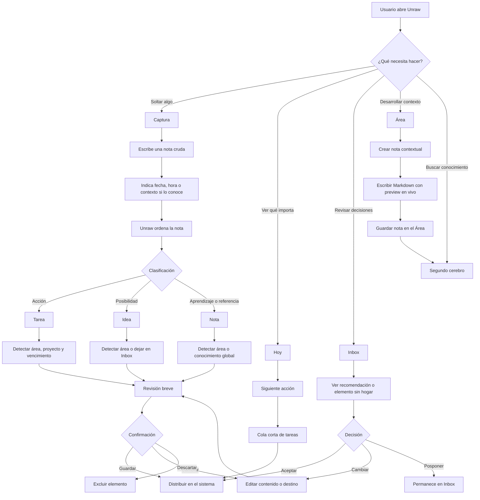

# Unraw — Ficha de proyecto

> Documento de orientación para producto, diseño, desarrollo y agentes de IA.

## 1. Resumen ejecutivo

**Unraw** es un sistema de productividad personal que convierte pensamiento crudo en estructura útil sin pedirle al usuario que diseñe primero una metodología completa.

La persona escribe como habla. Unraw interpreta el contenido, detecta acciones, ideas, conocimiento, fechas y contexto, y propone dónde debe vivir cada elemento. El usuario mantiene el control mediante confirmación, corrección o descarte.

### Frase del producto

> **Tú capturas. Unraw le da forma.**

### Problema principal

Las personas tienen muchas ideas, tareas y aprendizajes, pero no los organizan porque las herramientas tradicionales exigen demasiado contexto antes de empezar:

- elegir un área;
- crear un proyecto;
- decidir una etiqueta;
- escoger una base de datos;
- mantener reglas y taxonomías.

Ese trabajo administrativo rompe el momento de captura y hace que el Inbox se convierta en una fuente de culpa.

### Respuesta de Unraw

Construir un **sistema invisible y adaptativo**:

- el usuario descarga el pensamiento;
- la aplicación interpreta;
- la estructura aparece como una propuesta;
- la persona solo interviene cuando algo necesita confirmación.

## 2. Público objetivo

### Usuario principal

Profesionales, freelancers, estudiantes avanzados y personas con muchos frentes abiertos que:

- capturan ideas constantemente;
- mezclan tareas, notas y referencias en el mismo texto;
- han intentado usar Notion, Obsidian u otros sistemas;
- abandonan esos sistemas porque mantenerlos consume demasiada energía;
- quieren claridad sin convertirse en administradores de su propia productividad.

### Perfil de referencia

**Daniela, 29 años**

Profesional independiente con trabajo, proyectos personales y aprendizaje continuo. Tiene muchas notas en el teléfono, chats y documentos, pero rara vez las procesa. No necesita otra herramienta para escribir; necesita un puente confiable entre **capturar** y **hacer**.

### No es el usuario principal

Unraw no está optimizado inicialmente para:

- equipos con flujos colaborativos complejos;
- gestión de proyectos empresarial;
- bases de datos altamente personalizadas;
- usuarios que quieren construir un sistema manual desde cero.

## 3. Valor que entregamos

| Necesidad | Cómo responde Unraw |
| --- | --- |
| Capturar rápido | Un editor único y sin configuración inicial |
| Convertir caos en acción | Clasificación automática en tareas, ideas y conocimiento |
| No olvidar fechas | Extracción de fechas naturales y horas explícitas |
| Evitar taxonomías rígidas | Inferencia de áreas y proyectos existentes |
| Mantener control | Confirmar, corregir o descartar antes de guardar |
| Pensar en profundidad | Notas Markdown ricas con vista previa en vivo |
| Recuperar el hilo | Hoy muestra una siguiente acción y una cola corta |
| No perder lo ambiguo | Inbox conserva elementos sin destino |

## 4. Modelo mental del producto

Unraw está compuesto por cuatro niveles progresivos:

```text
Captura
  ↓
Inbox / decisiones pendientes
  ↓
Hoy / orientación
  ↓
Áreas / contexto
      ├── Proyectos
      ├── Tareas
      ├── Ideas
      └── Conocimiento
```

### Captura

Es la puerta de entrada principal. Debe desaparecer mientras el usuario escribe.

### Inbox

No es un depósito de trabajo pendiente. Es un espacio de triage donde viven temporalmente los elementos que aún no tienen un hogar claro.

### Hoy

No es un dashboard de métricas. Es una superficie de orientación para responder: **¿qué importa ahora?**

### Área

Es el contexto estable de una parte de la vida o del trabajo. Dentro de ella conviven acción y conocimiento.

## 5. Flujo de uso



## 6. Cómo lo usará una persona

### Escenario A — Nota mezclada

El usuario escribe:

> “Mañana llamar al contador. También quiero revisar si podemos automatizar los reportes mensuales y guardar la idea de separar un bloque de trabajo profundo los viernes.”

Unraw propone:

- una tarea con vencimiento mañana;
- una idea sobre automatizar reportes;
- una nota o idea sobre trabajo profundo;
- áreas y proyectos existentes cuando hay suficiente contexto.

La persona revisa, corrige si hace falta y confirma.

### Escenario B — Fecha natural

El usuario escribe:

> “Preparar la presentación para el lunes y enviarla el viernes a las 15:00.”

Unraw conserva la intención temporal:

- fecha de la tarea;
- hora explícita cuando existe;
- zona horaria del navegador;
- vencimiento visible antes de guardar.

### Escenario C — Nota profunda dentro de un Área

Desde un Área, el usuario pulsa **Nueva nota**. El Área ya está seleccionado por contexto, así que puede empezar a escribir directamente:

- título;
- contenido Markdown;
- listas, citas, enlaces o código;
- preview en vivo;
- etiquetas opcionales.

No tiene que decidir de nuevo dónde vive la nota.

## 7. Arquitectura funcional

### Entidades principales

| Entidad | Propósito |
| --- | --- |
| `areas` | Contextos estables de vida o trabajo |
| `projects` | Resultados concretos dentro de un Área |
| `tasks` | Acciones con estado, proyecto opcional y vencimiento |
| `ideas` | Posibilidades que todavía no son compromisos |
| `second_brain` | Notas, conceptos, aprendizajes y referencias |
| `inbox_items` | Elementos que todavía no tienen un hogar |
| `capture_batches` | Historial de capturas, output revisado y referencias guardadas |
| `profiles` | Preferencias, onboarding y configuración del usuario |

### Reglas de organización

- Un proyecto pertenece a un Área.
- Una tarea pertenece a un Área y puede pertenecer a un Proyecto.
- Una idea pertenece a un Área.
- Una nota puede pertenecer a un Área o ser conocimiento global.
- Un elemento sin suficiente contexto permanece en Inbox.
- La IA propone; el usuario confirma los cambios con impacto estructural.

## 8. Comportamiento de la IA

La IA debe ser útil sin convertirse en protagonista visual.

### Responsabilidades

- clasificar el contenido;
- inferir área y proyecto;
- extraer fechas y horas naturales;
- sugerir nuevas estructuras cuando nada encaja;
- conservar el texto original;
- explicar propuestas de forma breve;
- aceptar correcciones sin bloquear el flujo.

### Lo que no debe hacer

- crear estructuras importantes sin confirmación;
- obligar a elegir área o proyecto para guardar;
- mostrar jerga como “la IA está procesando”;
- inventar fechas que no aparecen en el texto;
- ocultar el contenido original;
- convertir toda idea en una tarea.

### Lenguaje de interfaz

Preferir:

- “Estamos ordenando tu captura…”
- “Sugerimos…”
- “Se guardará en Inbox.”
- “Cambiar destino.”
- “Vence el lunes.”

Evitar:

- “La IA está pensando…”
- “Prompt…”
- “Token…”
- “Modelo…”
- “Pipeline…”

## 9. Stack técnico

| Área | Tecnología |
| --- | --- |
| Framework | Next.js 15 con App Router |
| UI | React 19 y TypeScript |
| Estilos | Tailwind CSS 4, DaisyUI y CSS propio |
| Motion | Motion / `motion/react` |
| Iconos | Reicons |
| Datos | Supabase PostgreSQL |
| Autenticación | Supabase Auth |
| Seguridad de datos | Row Level Security y RPC transaccional |
| Procesamiento | OpenAI y OpenRouter |
| Email | Resend |
| Markdown | React Markdown, remark GFM y rehype |
| Hosting | Dokploy o plataforma compatible con Next.js |

## 10. Design system

### Principios

1. **Neutralidad:** la interfaz no compite con el pensamiento.
2. **Espacio:** la respiración visual tiene prioridad sobre la densidad.
3. **Jerarquía tipográfica:** la estructura viene de escala, peso y ritmo.
4. **Contexto progresivo:** mostrar opciones solo cuando son necesarias.
5. **Corrección reversible:** cada decisión importante debe poder cambiarse.
6. **Motion sobrio:** animar para orientar, no para decorar.

### Paleta semántica

| Token | Uso |
| --- | --- |
| `--bg-page` | Fondo principal |
| `--bg-surface` | Paneles y superficies |
| `--bg-hover` | Hover |
| `--bg-active` | Elemento seleccionado |
| `--border` | Bordes sutiles |
| `--text-primary` | Texto principal |
| `--text-secondary` | Texto de apoyo |
| `--text-muted` | Metadatos y placeholders |
| `--flow-accent` | Propuestas, estados de organización y acciones de flujo |
| `--raw-accent` | Captura cruda, Inbox y contenido pendiente |

### Tipografía

- **Geist Sans:** títulos, cuerpo y controles.
- **Geist Mono:** fechas, etiquetas, contadores y metadatos.
- Tracking contenido y jerarquía clara antes que decoración.

### Componentes

- Sidebar de 224 px en desktop.
- Shell responsive con header móvil.
- Botón primario oscuro y acciones secundarias discretas.
- Cards con bordes finos y radios contenidos.
- Editor documental con toolbar mínima.
- Preview Markdown en vivo para conocimiento.
- Empty states explicativos, no punitivos.
- Focus states visibles y navegación por teclado.

### Motion y accesibilidad

- Transiciones cortas y funcionales.
- Crossfades de loading sin bloquear el documento.
- Respeto a `prefers-reduced-motion`.
- `aria-live` para cambios de estado relevantes.
- Scroll perteneciente al documento por defecto; scroll interno solo en regiones intencionales.

## 11. Estado y próximos pasos

### Ya resuelto

- Captura sin fricción.
- Organización asistida.
- Detección de fechas naturales.
- Inbox con triage básico.
- Hoy como orientación.
- Notas Markdown contextuales.
- Dark mode y responsive base.
- Command Palette.

### Siguiente evolución

1. Inbox con recomendaciones de destino y acción.
2. Búsqueda y filtros para Segundo cerebro.
3. Guardado progresivo de borradores.
4. Relaciones entre notas, proyectos y tareas.
5. Registro de correcciones para mejorar las inferencias.
6. Pruebas E2E autenticadas en desktop y móvil.

## 12. Preguntas de producto abiertas

- ¿Cuándo debe una sugerencia de nueva Área aparecer aprobada por defecto?
- ¿Qué correcciones deben aprenderse automáticamente?
- ¿Qué relaciones entre notas son suficientemente útiles para mostrar sin ruido?
- ¿Cuándo una idea está lista para convertirse en proyecto?
- ¿Qué nivel de historial necesita una nota sin convertirla en un sistema pesado?
